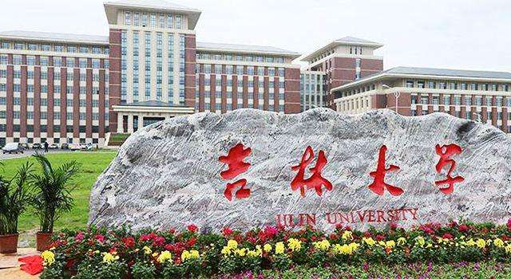

# 计算机专业英语作业

学号：21181525
姓名：杨建华

[第二个md文件](./second.md)。
***
## 图片
#### 目录中的图片

#### 网络图片

***

## 代码
```cpp
#include <iostream>
using namespace std;
int main(){
cout<<"Hello World!";
return 0;
}
```
***
## 链接
[吉林大学官网](https://www.jlu.edu.cn/)
***
## 块注释
>注释
***
## 列表
1. 杨
2. 建
3. 华

* 2118
* 1525
***
## 表格
|  学号   | 姓名  |
|  ----  | ----  |
| 21181525  | 杨建华 |
***
## 文本
#### 粗体
**粗体文本**

#### 斜体
*斜体文本*

#### 划线文本
~~划线文本~~
***
## 水平尺
***

# 专业英语作业
